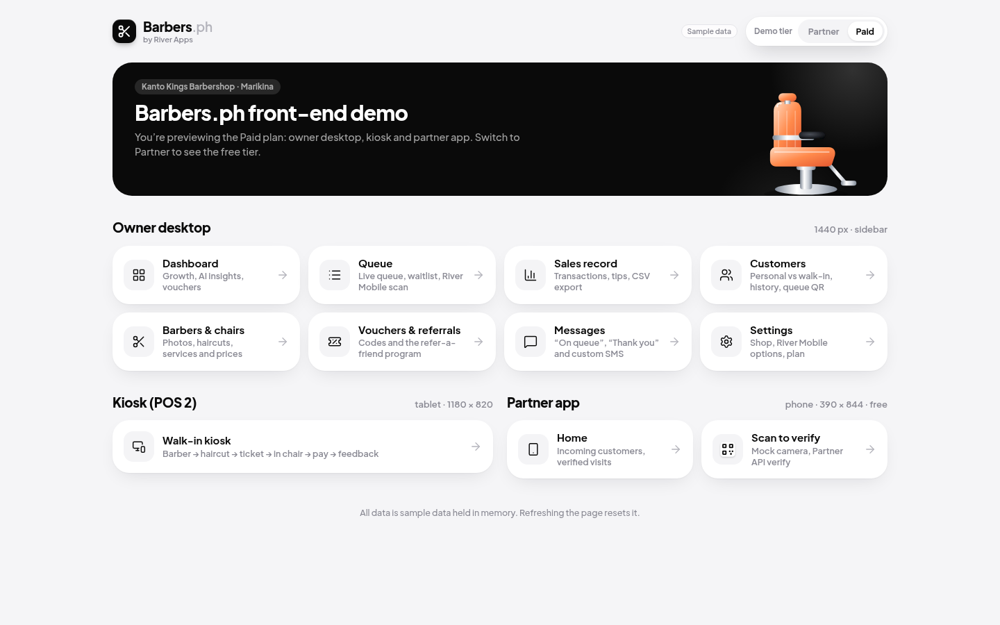
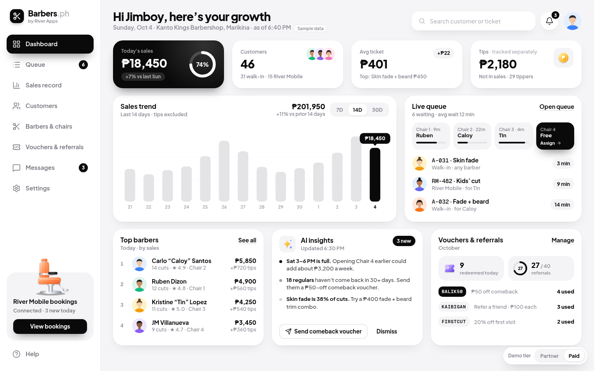
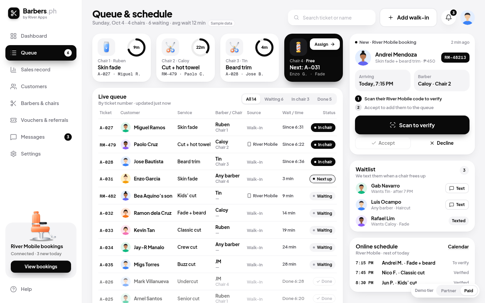
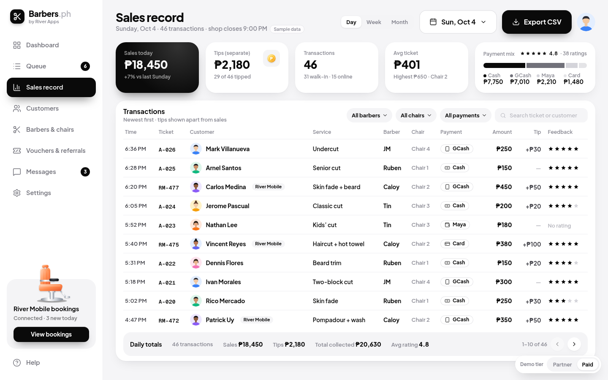
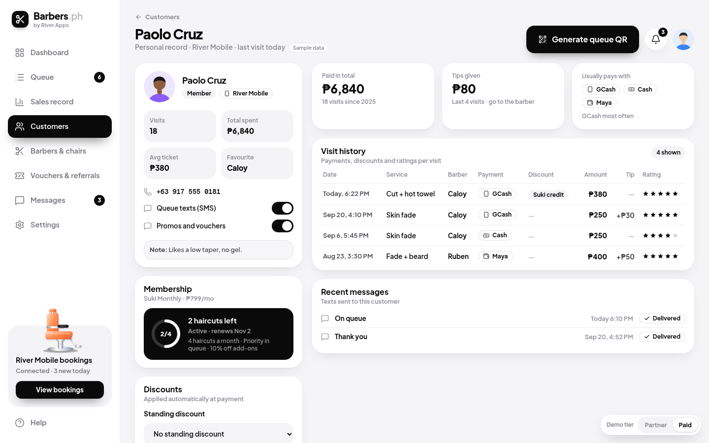
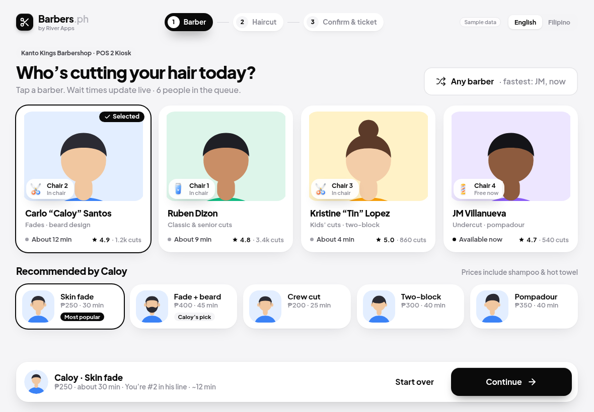
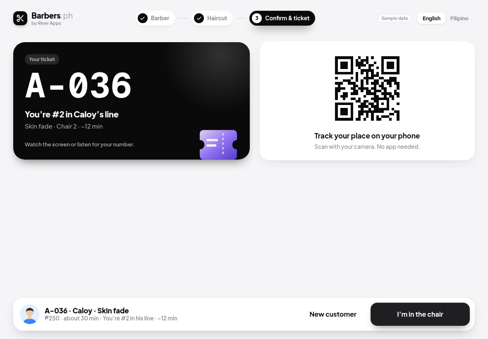
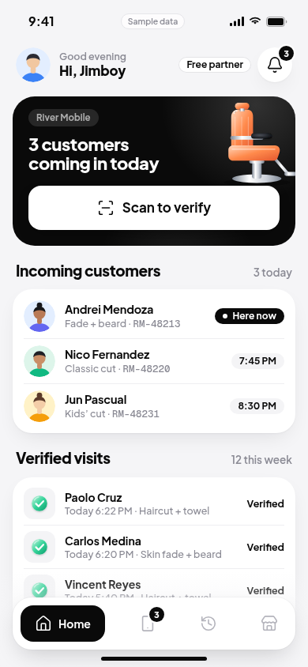
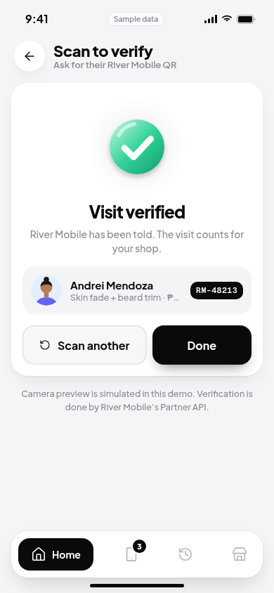

# Mybarberph: Barbers.ph front-end (UI MVP)

The **Barbers.ph** barbershop app from River Apps, built as a front-end only. It has three parts: the owner desktop, a walk-in kiosk (POS 2) and the free Partner phone app. There is **no backend yet**. **All data is sample data** held in memory behind a repository interface, so Firebase can be swapped in later without touching the screens. Every screen shows a `Sample data` tag.



- **One app, two plans.** A demo tier switch sits at the bottom right of every screen and is saved in the `bp_demo_tier` cookie.
  - **Partner (free)** has the River Mobile partner app only: incoming customers, scan to verify, history, shop. The Paid screens still show, but as an upgrade entry point.
  - **Paid** has everything: the owner desktop, the kiosk and the partner app.
- **Stack:** Next.js 16 (App Router, Turbopack), React 19, TypeScript 5.9, Tailwind CSS 4, lucide-react, npm.
- **UI:** the private **River Apps UI Kit** ([`idealchop/river-apps-ui-kit`](https://github.com/idealchop/river-apps-ui-kit)). It is used as-is and never modified.
- **Wording:** a station is always called a **Chair**, never a "Bay".

## Setup

Requirements: Node 20.9+, npm 10, and **read access to the private kit repo**.

```bash
git clone --recurse-submodules https://github.com/idealchop/Mybarberph.git
cd Mybarberph
# if you cloned without submodules:
git submodule update --init --recursive

npm install
npm run dev        # builds the kit tokens, then http://localhost:3300
```

| Script | What it does |
| --- | --- |
| `npm run dev` | `kit:build`, then `next dev` on port 3300 |
| `npm run build` | `kit:build`, then `next build` (production) |
| `npm start` | serves the production build on port 3300 |
| `npm run lint` | ESLint (Next core-web-vitals + TypeScript) |
| `npm run typecheck` | `kit:build`, then `tsc --noEmit` |
| `npm run kit:build` | generates the kit's tokens (`theme.css`, `fonts.css`, `tokens.css`) into the submodule's git-ignored `dist/` |
| `npm run screenshots -- <baseUrl> <outDir> [filter]` | Playwright screenshots of every screen at the mockup sizes. Needs `pip install playwright && playwright install chromium`. |

Open **http://localhost:3300/**. It is a launcher that links to every screen and has the tier switch.

## Routes

| Route | Device | Plan | Screen |
| --- | --- | --- | --- |
| `/` | any | both | Demo launcher: every screen grouped by device |
| `/dashboard` | desktop 1440 | Paid | KPIs, 14-day sales trend, live queue and chairs, top barbers, AI insights, vouchers |
| `/queue` | desktop | Paid | Live queue by chair, waitlist, assign/start/finish, River Mobile scan dialog |
| `/sales` | desktop | Paid | Sales record: Today/Week/Month, payment mix, transactions, tips kept separate, CSV export |
| `/customers` | desktop | Paid | Personal vs walk-in records, search and filters |
| `/customers/[id]` | desktop | Paid | Customer detail: visits, membership, vouchers, notes, **queue QR** |
| `/barbers` | desktop | Paid | Barbers & chairs: photos, haircut gallery, services and prices, chair status |
| `/vouchers` | desktop | Paid | Voucher codes and the refer-a-friend program |
| `/messages` | desktop | Paid | SMS templates ("On queue", "Thank you", custom) and the send log |
| `/settings` | desktop | Paid | Shop profile, hours, River Mobile options, plan and billing |
| `/kiosk` | tablet 1180×820 | Paid | Walk-in flow: barber → haircut → confirm → ticket (QR) → in chair → pay (+ tip) → feedback, with an EN/Filipino toggle |
| `/partner` | phone 390×844 | both | Partner home: incoming River Mobile customers, verified visits this week |
| `/partner/incoming` | phone | both | Incoming bookings with accept/decline |
| `/partner/scan` | phone | both | Scan to verify (mock camera) → verified |
| `/partner/history` | phone | both | Verified visit history |
| `/partner/shop` | phone | both | Shop profile and the upgrade to Paid |

On a desktop browser, the partner app is shown inside a 390×844 phone frame. On a real phone it fills the screen.

## Project structure

```
src/
  app/                 routes (App Router)
    (shop)/            owner desktop routes that share the sidebar shell (layout.tsx)
    kiosk/ partner/    the tablet and phone apps (their own shells)
    layout.tsx         reads the tier cookie on the server and provides TierProvider
    page.tsx           the demo launcher
  features/<area>/     screen components (client components, seeded from server props)
  components/
    shell/             ShopShell (kit AppShell + Sidebar + Topbar), nav, Brand, DemoTierSwitch, ClientNav
    common/            Dialog/Toggle/SelectField, QrCode, LockedFeature, small panels and pills
    art/               barbershop art in the kit's 3D style (chair, clippers, comb, razor, pole, people)
  data/
    types.ts           domain types (money is integer centavos)
    repository.ts      the Repository interface every screen talks to
    mock/              seed data + in-memory MockRepository
    firebase/          notes for the future Firestore adapter
    index.ts           getRepository(): picks the data source
  lib/                 tier gating (tier-shared.ts, tier.tsx), formatting (peso, dates)
scripts/
  kit-build.mjs        checks the submodule, then builds the kit tokens
  screenshots.py       Playwright screenshots of every screen
vendor/river-apps-ui-kit   private git submodule (pinned commit)
```

## How the UI kit is reused

This follows the same approach as the other kit-based apps (Mygymph, Laundry.ph). No kit source, fonts or artwork are committed here.

- **Git submodule.** `vendor/river-apps-ui-kit` is pinned to a kit commit. This repo stores only the URL (`.gitmodules`) and the commit pointer.
- **Consumed from source.**
  - `tsconfig.json` `paths` and `next.config.ts` `turbopack.resolveAlias` map `@river-apps/ui` and `@river-apps/icons` to the kit's `packages/*/src`, and `@river-apps/tokens/*` to the generated `dist/`.
  - Only the tokens need a build step. `scripts/kit-build.mjs` runs the kit's own token generator, and `dev`, `build` and `typecheck` run it first.
  - If the submodule is missing, the script stops with setup instructions.
- **Tailwind 4.**
  - `src/app/globals.css` imports `@river-apps/tokens/theme.css`, so the kit's colours, radii, shadows and fonts become utilities such as `bg-canvas`, `text-ink`, `rounded-card` and `shadow-card`.
  - It also adds `@source` for the kit UI source, so Tailwind generates the kit's own classes.
- **Fonts.** `src/app/layout.tsx` imports `@river-apps/tokens/fonts.css` (Plus Jakarta Sans and Geist Mono). The fonts are bundled at build time.
- **Kit components used.**
  - Layout: `AppShell`, `Sidebar`, `Topbar`, `MobileTabBar`.
  - Actions and labels: `Button`, `IconButton`, `Badge`, `SampleDataTag`, `LogoMark`.
  - Cards and media: `CardHeader`, `IconTile`, `Avatar`, `ProgressRing`, `HeroBanner`, `ResourceCard`, `BarChart`.
  - Inputs: `SegmentedControl`, `Input`, `SearchInput`, `PhoneInput`.
  - States and helpers: `EmptyState`, `SuccessState`, `cn`.
  - From `@river-apps/icons`: `CheckIcon`, `CoinIcon`, `SparkleIcon`, `AVATAR_PRESETS`.
- **Kit links.** The kit renders plain `<a>` links. `ClientNav` turns same-origin clicks into `router.push`, so moving between screens stays client-side.
- **App art is original to this repo** (`src/components/art`). The barber chair, the service icons (clippers, comb, razor, scissors, pole, QR and more), the portraits and the haircut thumbnails are drawn in the kit's style.

> **Access note.** Without access to the private kit, `npm run dev`, `build` and `typecheck` stop with a clear message. A public CI run can't build this repo unless it is given read access to the kit, for example through a deploy key or a fine-grained token stored as a CI secret.

## Data layer (Firebase-ready)

- Screens never import seed data directly. Server pages call `getRepository()` and pass plain props to client components. Client components keep local state and call the same repository for mutations, such as assign chair, finish service, verify scan, create voucher and send SMS.
- `src/data/repository.ts` is the contract. `MockRepository` implements it in memory from `mock/seed.ts`. The shop clock is fixed at **Sun, Oct 4, 2026, 6:40 PM** so the demo always looks the same.
- To add Firebase:
  1. Implement `Repository` with Firestore (see `src/data/firebase/README.md`).
  2. Set `NEXT_PUBLIC_DATA_SOURCE=firebase`.
  3. Return the new adapter from `getRepository()`.
- Money is stored as integer **centavos** and shown with `peso()` (`₱1,250`). Tips are kept out of sales totals.

## Tier gating

- `src/lib/tier-shared.ts` defines the server-safe pieces: the cookie name, the `Feature` list and `canUse(tier, feature)`.
- `src/lib/tier.tsx` provides `TierProvider` / `useTier()` and the switch.
- Paid-only screens use `LockedFeature` on the Partner tier, which shows an upgrade card in place of the screen. The partner app works on both tiers.

## Demo-only details

- The phone status bar (9:41, signal and battery) is demo chrome in the partner frame.
- The camera on **Scan to verify** is simulated. Verification goes through the repository's `verifyScan`, which stands in for River Mobile's Partner API. Device pairing in Settings is mock too.
- Queue and ticket QR codes are real and scannable (`qrcode-generator`) and encode the ticket or customer code.
- The kiosk's Filipino translation covers the main headings and buttons only.
- Photo upload and receipt printing are stubs. CSV export builds the file in the browser from the sample transactions.
- State is held in memory, so a full page reload resets the sample data.

## Screenshots

`docs/screenshots/` has a selection of screens. The full set, at the mockup sizes (desktop 1440×900, kiosk 1180×820, phone 390×844), is produced by `npm run screenshots -- http://localhost:3300 <outDir>`.

| | |
| --- | --- |
|  |  |
|  |  |
|  |  |
|  |  |
